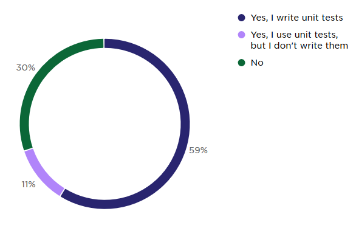
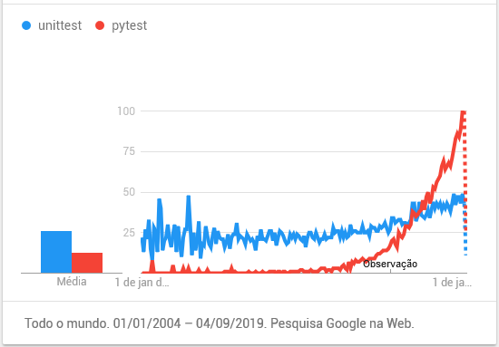
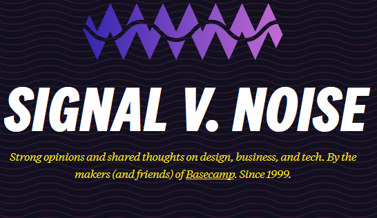

@title[Cover]

## Testes de Regressão
### para modelos numéricos e ORMs

<span style="font-size: 0.5em">[ Igor T. Ghisi, Flask-Conf, 2019-09-08 ]</span>

---?color=linear-gradient(90deg, white 50%, black 20%)
@title[Who Am I]

@snap[west span-45 text-07]
- Cria Apps & Libs Python (Desktop & Web) desde 2004
- Trabalha na ESSS
- Cria soluções para área de P&D da Industria de Óleo & Gas
@snapend

@snap[south-west span-30]

@snapend

@snap[east text-white]
@fa[github] igortg
@fa[twitter] figortg
@snapend


---
@title[Abrindo o apetite]

## Abrindo o apetite...

---
@title[Abrindo o apetite]

@code[python code-reveal-fast](src/sqlalchemy_hello/player_char.py)

@[33-48]
@[49-65]

---
@title[Abrindo o apetite]

@code[python](src/sqlalchemy_hello/tests/test_player_char.py)

@[22-28](antes)
@[28-38](antes)
@[41-50](depois)
@[46-50](depois)

---
@title[Abrindo o apetite]

@code[python code-reveal-fast](src/sklearn_hello/test_sklearn_tutorial.py)

@[5-14]
@[15-19](antes)
@[15-26](antes)
@[27-35](depois)

Note:
Só testa alguns valores
Faz um round maroto

---

@snap[midpoint span-100]
## Testes?
@snapend

@snap[south-east span-100 text-08]
@quote[Something that is untested is broken.](Flask Official Docs)
@snapend

---?color=linear-gradient(180deg, white 58%, gray )
@title[JetBrains Survey]

@snap[north span-100]

@snapend

@snap[south span-100 text-07]
16% dos devs NÃO TEM nenhum tipo de teste em seus projetos.
Percentual baixa para 8% considerando só profissionais senior.
<span style="font-size: 0.5em;">JetBrains. _The State of Developer Ecosystem 2018/2019_</span>
@snapend


---
@title[Pytest Quick Intro]

## Pytest

---
@title[Pytest Quick Intro]

@snap[west span-55]

@snapend

@snap[east span-40]
@box[bg-orange text-white text-07 fragment](Pytest tornou-se o framework de testes padrão _de facto_ para Python)
.
@box[bg-orange text-white fragment](Capítulo de testes da Flask Doc baseado no Pytest)
@snapend

---
@title[Pytest Quick Intro]

`roman7.py`

```python
def to_roman(n):
    '''convert integer to Roman numeral'''
    ...

def from_roman(s):
    '''convert Roman numeral to integer'''
    ...
```

---
@title[Pytest Quick Intro]

`test_roman7.py`

```python
from roman7 import to_roman, from_roman

def test_roman_conversion():
    assert to_roman(3) == 'III'
    assert from_roman('IV') == 4
```

---
@title[Fixtures]

## Pytest fixtures

---
@title[Fixtures - definition]

@snap[midpoint span-100 text-06]
### O que são fixtures?
@quote[fixture provide a fixed baseline upon which tests can reliably and repeatedly execute](pytest docs)
@snapend

---
@title[Fixtures - definition]

@snap[midpoint span-100 text-06]
### O que são fixtures?
@quote[resolve problemas reais que ocorrem na criação de testes unitários](Ghisi, 2018)
@snapend

---
@title[Fixtures - example]

@code[python](src/spreadsheet2csv/xls2csv.py)

---
@title[Fixtures - example]

@code[python code-reveal-fast](src/spreadsheet2csv/tests/test_xls2csv.py)

@[4-10]
@[5](problema: caminho relativo)
@[7-10](problema: não escala)
@[6](problema: caminho relativo e deixa lixo após execução)

---
@title[Fixtures - tmpdir]

@code[python](src/spreadsheet2csv/tests/test_xls2csv.py)

@[13-20]
@[13, zoom-15](declarando a fixture)
@[15, zoom-15]
@[13-20]

---
@title[Plugins]

## Pytest plugins
Pacotes python que disponibilizam uma ou mais fixtures

---
@title[pytest-datadir]


@snap[midpoint span-100]
## pytest-datadir
@box[bg-black text-white](`pip install pytest-datadir`)
@snapend

---
@title[pytest-datadir]

@snap[north span-100]
Organiza os arquivos de suporte dos testes
@snapend

@snap[midpoint span-66 text-16]
```bash
├── test_xls2csv/
│   ├── sample.xlsx
└── test_xls2csv.py
```
@snapend


---
@title[pytest-datadir]

@code[python code-reveal-fast](src/spreadsheet2csv/tests/test_xls2csv.py)

@[23-26]
@[23-30]

Note:
Mencionar que o datadir copia tudo pra um arquivo temporario

---
@title[pytest-regressions]

@snap[midpoint span-100]
## pytest-regressions
@box[bg-black text-white](`pip install pytest-regressions`)
@snapend

---
@title[file_regression]

@snap[midpoint span-100]
## File Regression
@box[bg-black text-white](`def test_foo(file_regression):`)
@snapend

---
@title[file_regression]

`file_regression` no xls2csv

@code[python code-reveal-fast](src/spreadsheet2csv/tests/test_xls2csv.py)

@[33-36]

---?image=assets/expanding-brain.jpg&size=45% 93%&color=black

---?color=linear-gradient(95deg, gray 64%, orange 36%)
@title[pytest-regressions]

@snap[west span-55 text-white]
Testes de Regressão
@quote[teste de software que visa garantir que o mesmo continue funcionando da mesma forma apos modificação ou adição de funcionalidade.](Wikipedia)
@snapend

---?color=linear-gradient(95deg, gray 64%, orange 36%)
@title[pytest-regressions]

@snap[west span-55 text-white]
TDD ou Testes Unitários?
@quote[Not doing TDD all the time is not a moral failure.](David Heinemeier Hansson)
@snapend

@snap[south-west span-55 text-white]
<span style="font-size: 0.5em;">Brian Oken. _Test & Code - Episode 45_</span>
@snapend


---
@title[file_regression]

`file_regression` em um Flask App
@code[python  code-reveal-fast](src/flask_hello/app.py)

@[7-12]

---
@title[file_regression]

`file_regression` em um Flask App
@code[python code-reveal-fast](src/flask_hello/tests/test_flask_app.py)

@[1-6]
@[7-12]

---
@title[num_regression]

@snap[midpoint span-100]
## Numeric Regression
@box[bg-black text-white](`def test_foo(num_regression):`)
@snapend

---
@title[num_regression]

@code[python code-reveal-fast](src/sklearn_hello/test_sklearn_tutorial.py)

@[6-13]
@[15-25](Teste ingênuo)
@[26-34](Teste com regression)
@[35-46](Teste com regression, definindo tolerância)

---
@title[data_regression]

@snap[midpoint span-100]
## Data Regression
@box[bg-black text-white](`def test_foo(data_regression):`)
@snapend

---
@title[data_regression]

@code[python code-reveal-fast](src/flask_hello/app.py)
@[14-18]
@[28-41]

---
@title[data_regression]
@code[python code-reveal-fast](src/flask_hello/tests/test_flask_api.py)

@[2-9]
@[11-14]
@[17-27]
@[24-27](Mais de uma regressão por teste - evitar)

---
@title[serialchemy]

@snap[midpoint span-100]
## serialchemy
@box[bg-black text-white](`pip install serialchemy`)
@snapend

---
@title[Serialchemy]

@snap[midpoint span-100 text-07 ]
@quote[We think that is possible to build a simpler and more maintainable solution by having SQLAlchemy in mind from the ground up, as opposed to marshmallow-sqlalchemy that had to be designed and built on top of marshmallow.]
@snapend

---
@title[Serialchemy]

@code[python code-reveal-fast](src/sqlalchemy_hello/player_char.py)

@[33-48]

---
@title[Serialchemy]

```python
>>> espada_nilfgaardian = Espada(
        nome="Nilfgaardian longsword",
        dano=36,
        min_level=3
    )
>>> character = PlayerChar(
        nome="Geraldo de Rivia",
        raca=RacaChar.Human,
        pontos_xp=3400,
        forca=9,
        habilidade=14,
        resistencia=13,
        inteligencia=16,
        arma_primaria=espada_nilfgaardian,
    )
>>> session.add(character)
>>> session.commit()
>>> serialized = serialchemy.dump(character, nest_foreign_keys=True)
>>> pp.pprint(serialized)
```

@[1-5]
@[1-15]
@[1-16]
@[1-17]
@[1-18]
@[1-19]

---
@title[Serialchemy]

```python
{ 'nome': 'Geraldo de Rivia',
  'raca': 1,
  'classe': 3,
  'data_criacao': '2019-09-05',
  'data_ultimo_level_up': None,
  'arma_primaria': { 'dano': 36,
                     'id': None,
                     'min_level': 3,
                     'nome': 'Nilfgaardian longsword'},
  'forca': 9,
  'habilidade': 14,
  'level': 4,
  'inteligencia': 16,
  'id': 1,
  'modificador_arco': None,
  'modificador_espada': None,
  'modificador_machado': None,
  'pontos_de_mana': None,
  'pontos_de_vida': None,
  'pontos_xp': None,
  'resistencia': 13}
```

@[4](Reconhece Tipos)
@[6-9](Serializa objetos aninhados)

---
@title[Serialchemy]

#### Serialização Customizada

```python
from serialchemy import ModelSerializer, Field

class PlayerCharSerializer(ModelSerializer):

    id =        Field(dump_only=True)
    pontos_xp = Field(load_only=True)

serializer = PlayerCharSerializer(PlayerChar)
serializer.dump(character)
```

@[5](`id` só é deserializado)
@[6](`pontos_xp` só é serializado)

---
@title[Serialchemy]

@code[python code-reveal-fast](src/sqlalchemy_hello/player_char.py)

@[80-89]

---
@title[Serialchemy]

```python
class PlayerCharSerializer(ModelSerializer):

    id = Field(dump_only=True)
    pontos_xp = Field(load_only=True)
    ja_pode_upar = Field(dump_only=True)
```

---
@title[Serialchemy]

@code[python code-reveal-fast](src/sqlalchemy_hello/tests/test_player_char.py)

@[22-37](Teste sem Regressão)
@[40-50]
@[48-51, zoom-12]
@[40, zoom-12]
@[40-50]

---

@table[table-header text-09](packages-state.csv)

---?color=linear-gradient(180deg, #cdd1d4 24%, white 20%)
@snap[north span-70]
## Roadmap
@snapend

@snap[midpoint span-100 text-left text-top]
#### serialchemy
- Method to automatically not dump primary and foreign keys
@snapend

@snap[south span-100 text-left text-top]
#### pytest-regressoions
- Support for Pandas DataFrames
@snapend

---
@title[People]


@snap[midpoint span-70]
### It's About People
@img[](assets/team.png)
@snapend
---

@snap[west text-04 text-center span-25]

Pytest Quick Start Guide - _Bruno Oliveira_
@snapend

@snap[midpoint text-04 text-center span-29]

http://signalvnoise.com - _Basecamp_
@snapend


@snap[east text-04 text-center span-28]

Test & Code - _Brian Oken_
@snapend

---

@snap[midpoint span-50]
### Isso é tudo
@box[bg-black text-white](@fa[github]/igortg/flask-conf-2019)
@snapend

---
